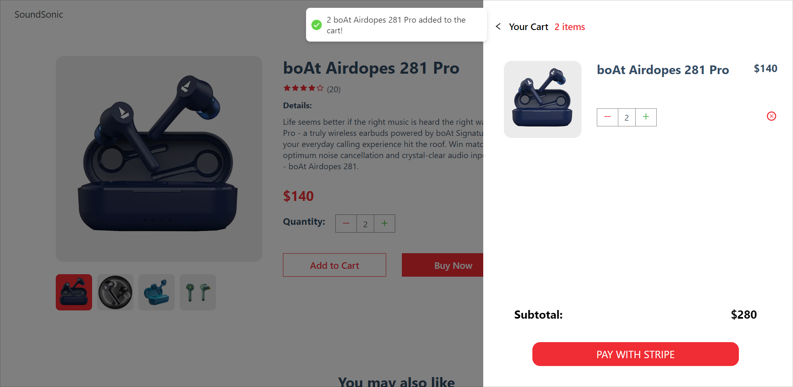

# SoundSonic

A modern ecommerce application which sells consumer electronics, primarily focusing on audio products.

## Technology stack

- NextJS
- Sanity CMS

## Functionalities

- Browse products
- Add/remove products to/from cart
- Order products
- Pay via Stripe

## Screenshots

## Note

- For completing a dummy payment via Stripe, you can find the test credentials [here](./assets/test-card-details.txt).
